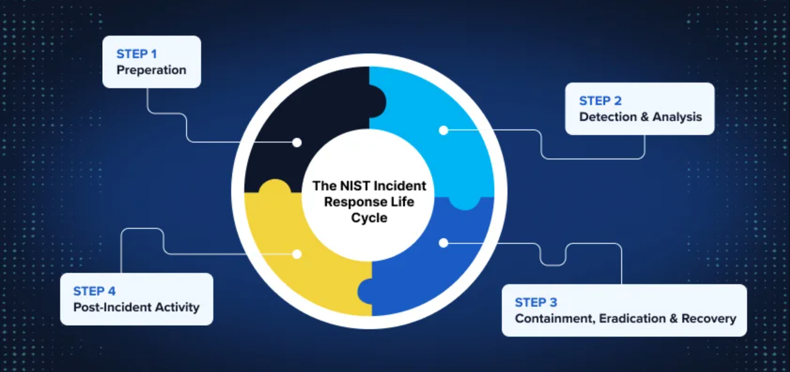

# COMP5002-BOTSv3-Incident-Report
Forensic analysis and incident response report for the BOTSv3 dataset, covering Phishing, Endpoint Compromise, and C2 detection

# 1.0 Introduction
## 1.1 Executive Summary
This forensic report details a comprehensive investigation into a security incident targeting the "Frothly Brewing Company." The investigation was triggered by anomalous behaviors detected within the Office 365 cloud environment and subsequently traced to on-premise endpoints. Acting as the Tier 2 Security Operations Center (SOC) team, the objective was to validate alerts, reconstruct the adversary’s attack path, and assess the scope of the compromise.

Utilizing the "Boss of the SOC v3" (BOTSv3) dataset, the analysis focused on logs from stream:smtp, WinEventLog:Security, Sysmon, and Osquery. The investigation confirmed a successful spear-phishing campaign that resulted in initial access, privilege escalation, and lateral movement. The adversary successfully established persistence on both Windows and Linux infrastructure, exposing critical deficiencies in Frothly's detection capabilities.

## 1.2 Scope and Objectives
The primary goal of this engagement was to conduct a root-cause analysis (RCA) adhering to the NIST SP 800-61 framework.

Scope: The investigation encompassed the hybrid environment, specifically User Activity on Office 365 (OneDrive), Endpoint Execution on Windows (FYODOR-L), and Linux Server Administration (hoth).

Objectives:

Map the attack lifecycle to the Cyber Kill Chain.

Identify Indicators of Compromise (IOCs) including malicious hashes, C2 IPs, and User Agents.

Provide strategic recommendations to elevate the SOC from a reactive to a proactive posture.

# 2.0 SOC Roles & Incident Handling Reflection
This section critically reflects on the SOC methodologies applied, demonstrating an understanding of industry standards and the operational hierarchy required for effective incident response.

  
   
  <em>Figure 1: The NIST SP 800-61 Incident Response Life Cycle (Cichonski et al., 2012).</em>

## 2.1 Investigative Workflow
To ensure a rigorous investigation, the workflow followed the standard incident response lifecycle. The diagram below illustrates the decision-making process used during this assessment.
