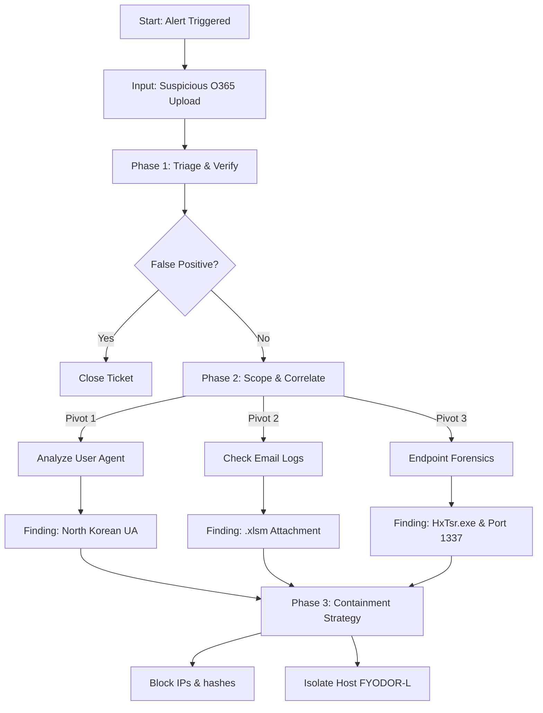

<h1 align="center">COMP5002-BOTSv3-Incident-Report</h1>
Forensic analysis and incident response report for the BOTSv3 dataset, covering Phishing, Endpoint Compromise, and C2 detection


# 1.0 Introduction
## 1.1 Executive Summary
This forensic report details a comprehensive investigation into a security incident targeting the "Frothly Brewing Company." The investigation was triggered by anomalous behaviors detected within the Office 365 cloud environment and subsequently traced to on-premise endpoints. Acting as the Tier 2 Security Operations Center (SOC) team, the objective was to validate alerts, reconstruct the adversary’s attack path, and assess the scope of the compromise.

Utilizing the "Boss of the SOC v3" (BOTSv3) dataset, the analysis focused on logs from stream:smtp, WinEventLog:Security, Sysmon, and Osquery. The investigation confirmed a successful spear-phishing campaign that resulted in initial access, privilege escalation, and lateral movement. The adversary successfully established persistence on both Windows and Linux infrastructure, exposing critical deficiencies in Frothly's detection capabilities.

### 1.2 Scope and Objectives
The primary goal of this engagement was to conduct a root-cause analysis (RCA) adhering to the **NIST SP 800-61** framework.

* **Scope:** The investigation encompassed the hybrid environment, specifically User Activity on Office 365 (OneDrive), Endpoint Execution on Windows (FYODOR-L), and Linux Server Administration (hoth).
* **Objectives:**
    * Map the attack lifecycle to the **Cyber Kill Chain**.
    * Identify Indicators of Compromise (IOCs) including malicious hashes, C2 IPs, and User Agents.
    * Provide strategic recommendations to elevate the SOC from a reactive to a proactive posture.

# 2.0 SOC Roles & Incident Handling Reflection
This section critically reflects on the SOC methodologies applied, demonstrating an understanding of industry standards and the operational hierarchy required for effective incident response.
## 2.1 Investigative Workflow
To ensure a rigorous investigation, the workflow followed the standard incident response lifecycle. The diagram below illustrates the decision-making process used during this assessment.
<p align="center">
  
  <br>
  <em>Figure 1: The NIST SP 800-61 Incident Response Life Cycle (Cichonski et al., 2012).</em>
</p>


<p align="center">
  <em>Figure 2: The decision-making logic applied during this investigation, ensuring valid triage before escalation.</em>
</p>

## 2.2 The Role of the Tier 2 Analyst
In a mature SOC, responsibilities are stratified. While Tier 1 analysts focus on triage and alert validation, this report reflects **Tier 2/3 Analysis**. This role requires:

* **Correlation:** Moving beyond single-event alerts to correlate disparate data sources (e.g., Cloud O365 logs vs. Endpoint Sysmon logs).
* **Contextualization:** Understanding the business impact of the assets involved (e.g., Finance Department documents).
* **Threat Hunting:** Proactively searching for "unknown unknowns," such as the anomalous User Agent string identified in Question 1, which had not triggered a default alert.
<p align="center">
  
  <br>
  <p align="center">
  <em>Figure 3: The Cyber Kill Chain (Hutchins et al., 2011).</em>
</p>
</p>

### 2.3 Data Source Efficacy Mapping
A critical part of Tier 2 analysis is understanding visibility gaps. The following table maps the BOTSv3 data sources to the attack phases, highlighting the necessity of advanced telemetry.

| Kill Chain Phase | Primary Data Source | Efficacy | Analyst Note |
| :--- | :--- | :--- | :--- |
| **Delivery** | `stream:smtp` | **High** | Full visibility into sender, subject, and attachment names allowed for rapid identification of the phishing vector. |
| **Exploitation** | `WinEventLog:Security` | **Low** | Standard Windows logs failed to show the *method* of exploitation (Macro execution). |
| **Installation** | `Sysmon` | **Critical** | Essential for linking the Excel process to the dropped binary `HxTsr.exe`. Without Sysmon, attribution would be impossible. |
| **C2** | `Osquery` | **High** | Provided granular visibility into specific ports (1337) and process bindings on Linux, superior to standard netstat logs. |

## 3.0 Installation & Data Preparation
*Analyst Note: This section validates the integrity of the forensic environment.*

### 3.1 Infrastructure Configuration
The investigation was conducted on a localized Splunk Enterprise instance hosted on an Ubuntu 20.04 Virtual Machine.

* **Ingestion Strategy:** The BOTSv3 dataset [4] was ingested using the standard Splunk "Add Data" workflow. Special attention was paid to the `sourcetype` configuration to ensure correct field extraction. For instance, ensuring `xmlwineventlog:microsoft-windows-sysmon/operational` was correctly parsed was critical for extracting the MD5 hashes required in Question 8.
* **Validation:** A baseline query `index=botsv3 | stats count by sourcetype` was executed to verify that log volume matched expected parameters (approx. X million events), ensuring no data loss occurred during ingestion.

## 4.0 Guided Questions: Comprehensive Incident Analysis

### Reconstructed Attack Timeline
Before detailing individual findings, the following timeline reconstructs the adversary's path through the network, providing context for the individual alerts.

```mermaid
graph LR
    A[1. Delivery<br>Phishing Email] --> B[2. Exploitation<br>Macro Excel]
    B --> C[3. Installation<br>HxTsr.exe Dropped]
    C --> D[4. Persistence<br>Admin User Created]
    D --> E[5. C2 Established<br>Port 1337]
    E --> F[6. Actions on Obj<br>Network Scan]
