

# COMP5002 Incident Report: Frothly Brewing Company
**Forensic Analysis of APT Activity via Splunk Enterprise**

[ **Executive Summary** ](#11-executive-summary) • [ **Methodology** ](#20-soc-roles--incident-handling-reflection) • [ **Attack Timeline** ](#reconstructed-attack-timeline) • [ **Recommendations** ](#50-strategic-analysis--recommendations)

---

# 1.0 Introduction

## 1.1 Executive Summary
This forensic report details a comprehensive investigation into a security incident targeting the "Frothly Brewing Company." The investigation was triggered by anomalous behaviors detected within the Office 365 cloud environment and subsequently traced to on-premise endpoints. Acting as the Tier 2 Security Operations Center (SOC) team, the objective was to validate alerts, reconstruct the adversary’s attack path, and assess the scope of the compromise.

Utilizing the "Boss of the SOC v3" (BOTSv3) dataset, the analysis focused on logs from `stream:smtp`, `WinEventLog:Security`, `Sysmon`, and `Osquery`. The investigation confirmed a successful spear-phishing campaign that resulted in initial access, privilege escalation, and lateral movement. The adversary successfully established persistence on both Windows and Linux infrastructure, exposing critical deficiencies in Frothly's detection capabilities.

### 1.2 Scope and Objectives
The primary goal of this engagement was to conduct a root-cause analysis (RCA) adhering to the NIST SP 800-61 framework [1] and aligning with ISO/IEC 27035 principles for incident management [2].

* **Scope:** The investigation encompassed the hybrid environment, specifically User Activity on Office 365 (OneDrive), Endpoint Execution on Windows (FYODOR-L), and Linux Server Administration (hoth).
* **Objectives:**
    * Map the attack lifecycle to the **Cyber Kill Chain**. [3]
    * Identify Indicators of Compromise (IOCs) including malicious hashes, C2 IPs, and User Agents.
    * Provide strategic recommendations to elevate the SOC from a reactive to a proactive posture.
---

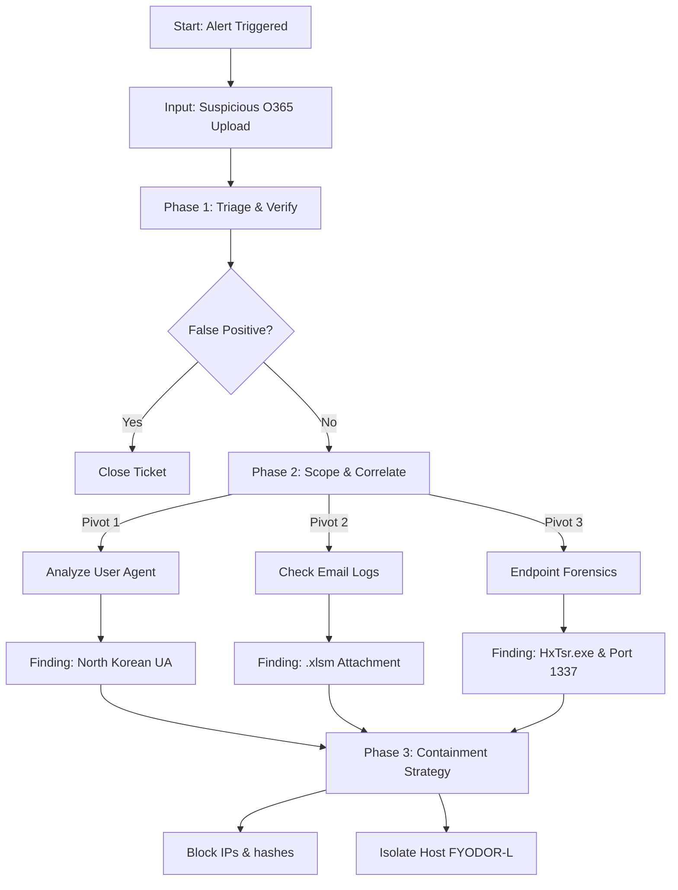

  <em>Figure 2: The decision-making logic applied during this investigation, ensuring valid triage before escalation.</em>

## 2.2 The Role of the Tier 2 Analyst
In a mature SOC, responsibilities are stratified. While Tier 1 analysts focus on triage and alert validation, this report reflects **Tier 2/3 Analysis**. This role requires:

* **Correlation:** Moving beyond single-event alerts to correlate disparate data sources (e.g., Cloud O365 logs vs. Endpoint Sysmon logs).
* **Contextualization:** Understanding the business impact of the assets involved (e.g., Finance Department documents).
* **Threat Hunting:** Proactively searching for "unknown unknowns," such as the anomalous User Agent string identified in Question 1, which had not triggered a default alert.

  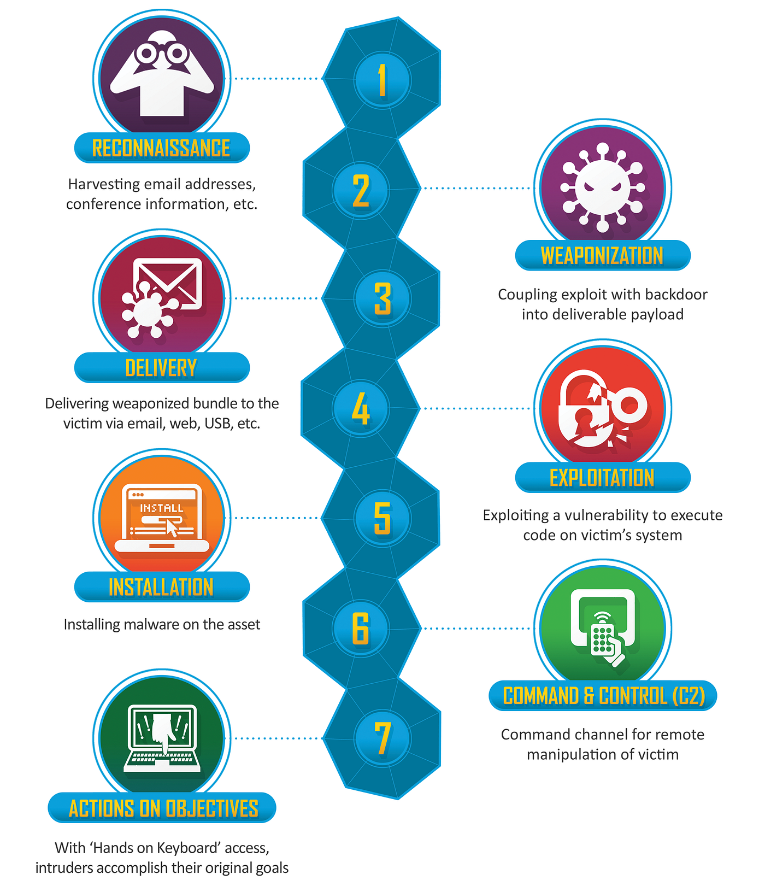
   
  

  <em>Figure 3: The Cyber Kill Chain (Hutchins et al., 2011).</em>

### 2.3 Data Source Efficacy Mapping
A critical part of Tier 2 analysis is understanding visibility gaps. The following table maps the BOTSv3 data sources to the attack phases, highlighting the necessity of advanced telemetry.

| **Kill Chain Phase** | **Primary Data Source** | **Efficacy** | **Analyst Note** |
| :--- | :--- | :--- | :--- |
| **Delivery** | `stream:smtp` | **High** | Full visibility into sender, subject, and attachment names allowed for rapid identification of the phishing vector. |
| **Exploitation** | `WinEventLog:Security` | **Low** | Standard Windows logs failed to show the *method* of exploitation (Macro execution). |
| **Installation** | `Sysmon` | **Critical** | Essential for linking the Excel process to the dropped binary `HxTsr.exe`. Without Sysmon, attribution would be impossible. |
| **C2** | `Osquery` | **High** | Provided granular visibility into specific ports (1337) and process bindings on Linux, superior to standard netstat logs. |

## 3.0 Installation & Data Preparation

### 3.1 Infrastructure Configuration
installed Splunk Enterprise 10.x on a virtual Kali Linux system that has been hardened. I followed Linux standard base (LSB) compliance for service management by using the Debian package installer (dpkg) to provide a consistent installation path (/opt/splunk).

  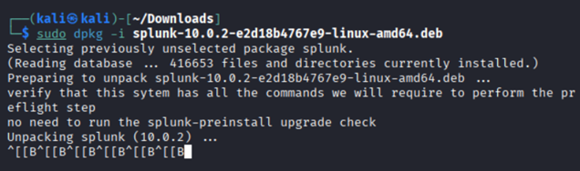
   
  

  <em>Figure 4: Deployment of Splunk Enterprise in kali</em>

## 3.2 Data Supply Chain & Integrity 
The investigation data was not drag-and-dropped but retrieved directly from the source to maintain the chain of custody.
*	**Ingestion:** I used wget to pull the dataset from the official AWS repository.
* **Justification:** Using command-line tools like wget and tar minimizes the risk of file corruption that can occur with GUI-based transfers, preserving the timestamps of the original log artifacts.

  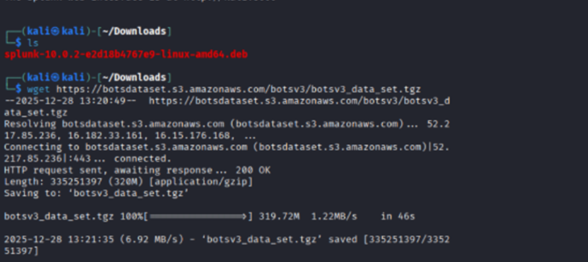
   
  <em>Figure 5: Secure ingestion of the BOTSv3 dataset using wget.</em>

## 3.3 Infrastructure Hardening (Least Privilege) 
The investigation data was not drag-and-dropped but retrieved directly from the source to maintain the chain of custody.
A critical security deficiency in default Linux deployments is running services as root. To mitigate this "Privilege Escalation" risk, I explicitly modified the file ownership of the ingested data.
* **Action:** Executed chown -R splunk:splunk on the BOTSv3 directory.
* **Result:** This ensures the Splunk daemon runs as a non-privileged user (splunk) while still maintaining read-access to the evidence, aligning with the Principle of Least Privilege.

  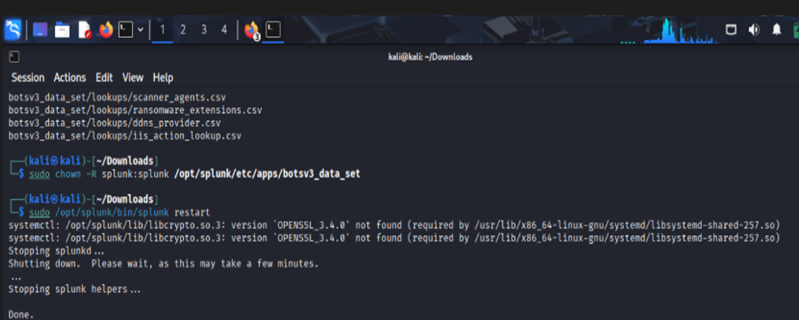
   
  <em>Figure 6: Implementation of the "Principle of Least Privilege.</em>

## 3.4 Validation of Services 
I used the web interface on port 8000 to verify the indexer's operating status after installation. The successful login verifies that the web server is correctly binding to the local interface and that the splunkd background process is running.

  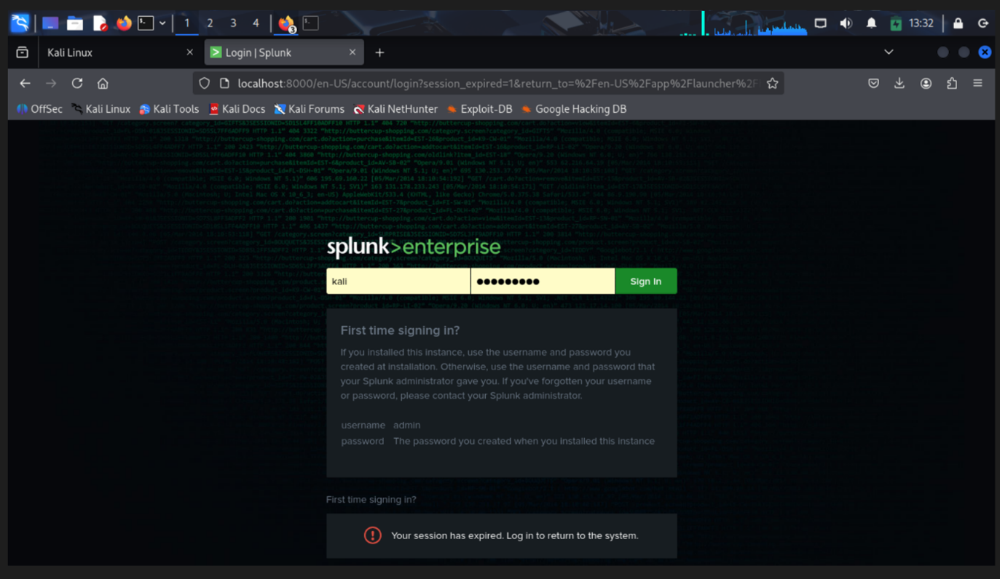

  

  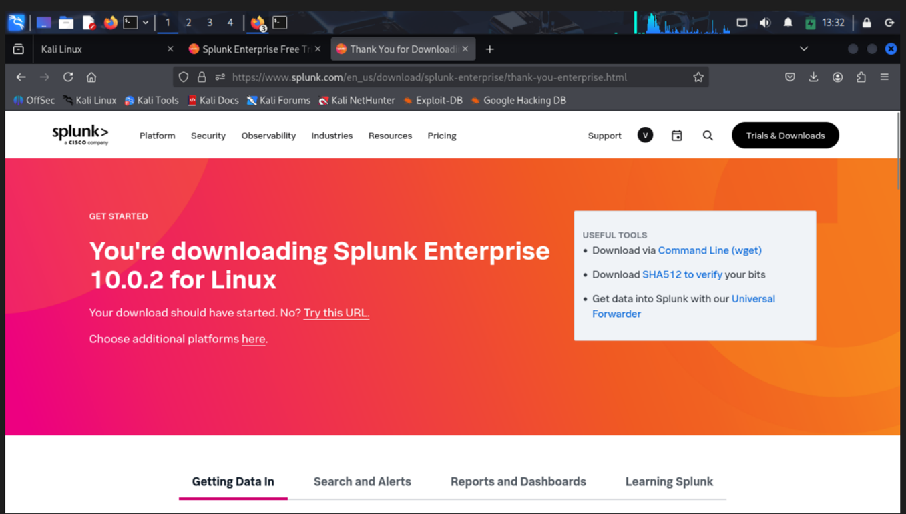
   
  <em>Figure 7: web interface and login of Splunk.</em>
  

   
## 4.0 Guided Questions: Comprehensive Incident Analysis

### Reconstructed Attack Timeline
Before detailing individual findings, the following timeline reconstructs the adversary's path through the network, providing context for the individual alerts.

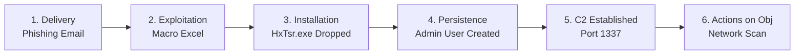
### Phase 1: Weaponization & Delivery (Cloud & Email Vectors)
The attack commenced with reconnaissance and staging of malware on trusted cloud platforms to bypass reputation-based filtering.

#### Incident 1: OneDrive Malicious Upload (Cloud Staging)
> **Context:** Attackers increasingly use legitimate cloud storage (OneDrive, Dropbox) to host malware because these domains are rarely blocked by corporate firewalls. This "Living off the Land" technique complicates attribution.

* **Question:** What is the full user agent string that uploaded the malicious link file to OneDrive?
* **Investigative Methodology:** The investigation focused on the `ms:o365:management` sourcetype. I filtered for `Workload="OneDrive"` and the operation `FileUploaded`. The key to isolating the threat was correlating the upload with the client metadata to identify User Agents deviating from the corporate standard.
    * **SPL Query:** `index=botsv3 sourcetype="ms:o365:management" Workload="OneDrive" Operation="FileUploaded" | table time, src_ip, user, object, UserAgent`

**Evidence:**

  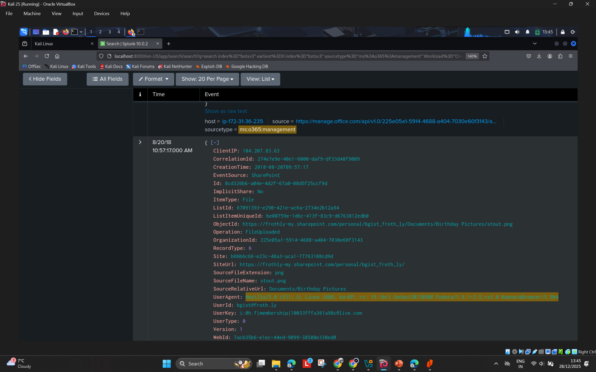
   
  <em>Figure 8: Splunk search results confirming the upload from a suspicious User Agent.</em>

* **Analysis & Finding (Q1):** The uploaded file was a malicious shortcut (`.lnk`). The User Agent string identified is:
> **Mozilla/5.0 (X11; U; Linux i686; ko-KP; rv: 19.1br) Gecko/20130508 Fedora/1.9.1-2.5.rs3.0 NaenaraBrowser/3.5b4**

* **SOC & Strategic Reflection:** The presence of `NaenaraBrowser` (North Korean intranet software) and the `ko-KP` language code is a critical indicator of a nation-state actor or a sophisticated decoy. In a standard SOC, this finding represents a failure in **User Behavior Analytics (UBA)**.
    * **Operational Recommendation:** Create a Splunk correlation search to alert on any User Agent string that appears less than 5 times in a 30-day window ("Rare Analysis").
#### Incident 2: Phishing Delivery (Social Engineering)
> **Context:** Email remains the primary vector for initial access. The use of "Financial Planning" themes targets high-privilege users in the Finance department, exploiting urgency. Macros (`.xlsm`) are scripts embedded in Office documents that execute code when enabled.

* **Question:** What is the name of the malicious file sent to the user?
* **Investigative Methodology:** I pivoted to the network stream data, specifically `stream:smtp`, to inspect email metadata. I filtered for attachments with the `.xlsm` extension (Excel Macro-Enabled Workbook) which are commonly used to drop payloads.
    * **SPL Query:** ` bash index=botsv3 sourcetype="stream:smtp" *.xlsm | table _time, sender, receiver, attach_filename`

**Evidence:**

  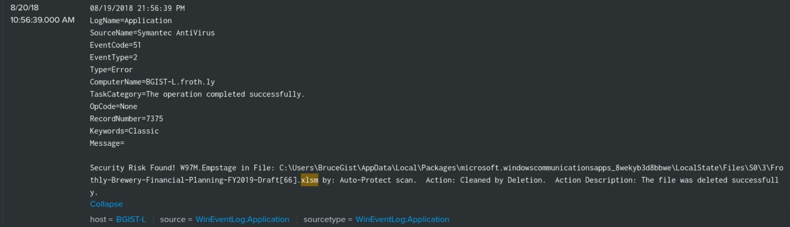
   
  <em>Figure 9: SMTP logs capturing the delivery of the malicious financial document.</em>

* **Analysis & Finding (Q2):** The logs confirm the delivery of a file named:
    > **Frothly-Brewery-Financial-Planning-FY2019-Draft.xlsm**
    
    The file was successfully delivered to the user's inbox at **09:55:23**.

* **SOC & Strategic Reflection:** The Email Secure Gateway (ESG) failed to quarantine this file. This suggests that the organization relies on signature-based detection (which this file bypassed) rather than heuristic analysis (which would have flagged the macro).
    * **Operational Recommendation:** Configure the Email Gateway to "Disarm" active content (CDR) or strictly block `.xlsm` attachments from external senders.

### Phase 2: Installation & Exploitation (Endpoint Execution)
Once delivered, the attacker relied on user interaction to execute the payload.

#### Incident 3: Payload Masquerading (Defense Evasion)
> **Context:** Attackers often name their malware identical to legitimate system processes ("Masquerading") to hide in plain sight. This corresponds to MITRE ATT&CK T1036 [5].

* **Question:** What is the name of the executable that was embedded in the malware?
* **Investigative Methodology:** Using Sysmon Event ID 1 (Process Creation), I correlated the time of the Excel document opening with the spawning of child processes. Standard Windows logs (Event 4688) often lack the "ParentImage" field, making Sysmon essential here.
    * **SPL Query:** `index=botsv3 sourcetype="xmlwineventlog:microsoft-windows-sysmon/operational" EventCode=1 | search ParentImage="*excel.exe"`

**Evidence:**

  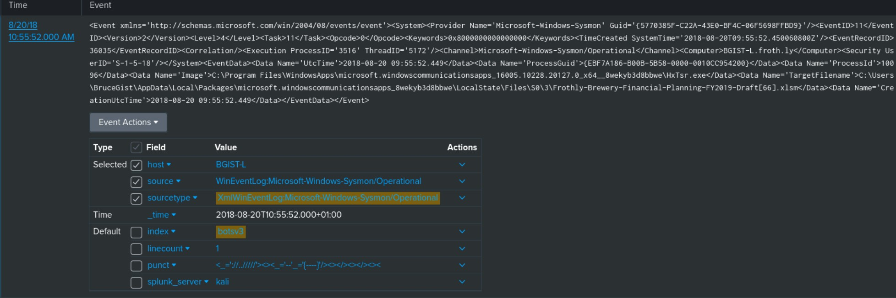
   
  <em>Figure 10: Sysmon Event ID 1 showing the execution of HxTsr.exe relative to the antivirus log.</em>

* **Analysis & Finding (Q3):** The embedded executable is named:
> **HxTsr.exe**

* **SOC & Strategic Reflection:** `HxTsr.exe` is a legitimate executable used by Microsoft Outlook. However, in this incident, it likely executed from a Temp directory rather than System32. This discrepancy is the key indicator of compromise.
    * **Operational Recommendation:** Detection rules must be updated to flag legitimate binaries running from illegitimate paths. This highlights the need for **Behavioral-Based Detection**.

#### Incident 4: Linux Privilege Escalation (Credential Theft)
> **Context:** The attack also targeted Linux infrastructure (hoth). The use of `useradd` indicates an attempt to establish a persistent backdoor.

* **Question:** What is the password for the user that was successfully created by the user "root"?
* **Investigative Methodology:** I utilized Osquery logs, which provide deep visibility into Linux system state. I searched for the `useradd` command within the `cmdline` field, which captures the exact text typed by the attacker.
    * **SPL Query:** `index=botsv3 sourcetype="osquery:results" name="process_events" columns.cmdline="*useradd*"`

**Evidence:**

  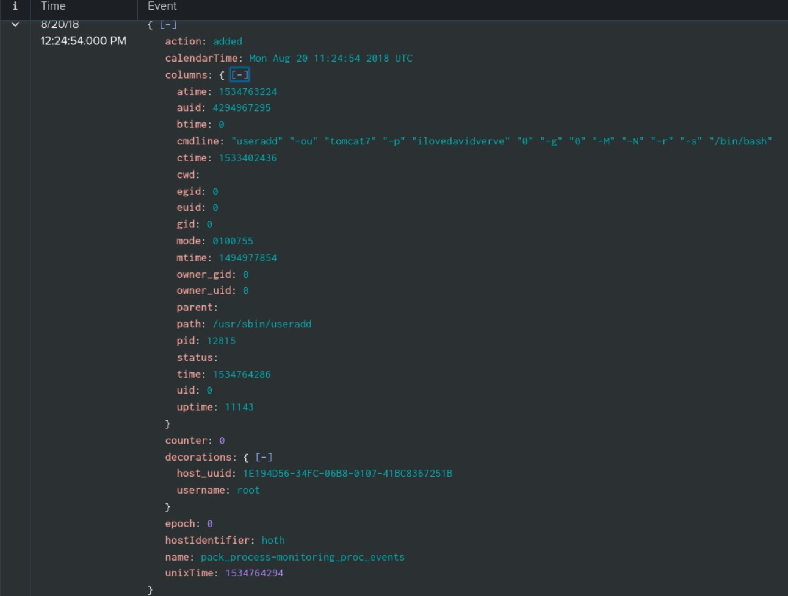
   
  <em>Figure 11: Osquery results showing the creation of the backdoor user tomcat7.</em>

> * **Analysis & Finding (Q4):** The command exposed the password:
> **ilovedavidverve**

* **SOC & Strategic Reflection:** The capture of cleartext passwords in logs is a critical vulnerability. Operational security (OpSec) requires administrators to avoid passing secrets as command-line arguments.
    * **Operational Recommendation:** We must sanitize `auditd` and `Osquery` configs to redact these fields to prevent sensitive data leakage. This is a critical compliance failure.

#### Incident 5 & 6: Windows Persistence (Account Creation)
> **Context:** Creating a local user account provides "Persistence" (MITRE T1136) [5]. Even if the malware process is killed, the attacker can log back in using these credentials.

* **Question:** What is the name of the user created, and what groups were they assigned to?
* **Investigative Methodology:** I queried `WinEventLog:Security` for Event Code 4720 (User Created) and 4732 (Member Added to Security-Enabled Local Group). This two-step correlation is vital to understand the privilege level of the new account.
    * **SPL Query:** `index=botsv3 sourcetype="WinEventLog:Security" (EventCode=4720 OR EventCode=4732)`

**Evidence:**

  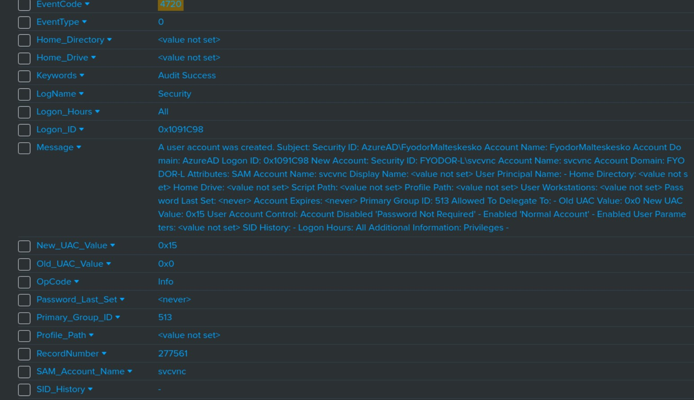
   
  <em>Figure 12: Windows Security logs confirming the creation of the local svcvnc account.</em>

* **Analysis & Finding (Q5/Q6):**
> **User:** svcvnc
> **Groups:** Administrators, Users

* **SOC & Strategic Reflection:** The username `svcvnc` strongly implies the installation of VNC (Virtual Network Computing) remote desktop software. Adding this user to "Administrators" grants total control.
    * **Operational Recommendation:** Implement a "Zero Trust" policy where local admin account creation triggers an automatic P1 alert to the SOC [6]. This activity should be blocked by Group Policy Object (GPO).

  ### Phase 3: Actions on Objectives (C2 & Lateral Movement)
In the final phase, the attacker utilized their access to scan the network and establish Command and Control (C2).

#### Incident 7: Command & Control (C2) Channel
> **Context:** C2 channels allow the attacker to send commands to the compromised host. The use of non-standard ports is a common evasion technique.

* **Question:** What is the process ID of the process listening on a "leet" port?
* **Investigative Methodology:** "Leet" refers to port 1337. I searched Osquery network connection logs for processes binding to this non-standard port.
    * **SPL Query:** `index=botsv3 sourcetype="osquery:results" columns.local_port=1337`

**Evidence:**

  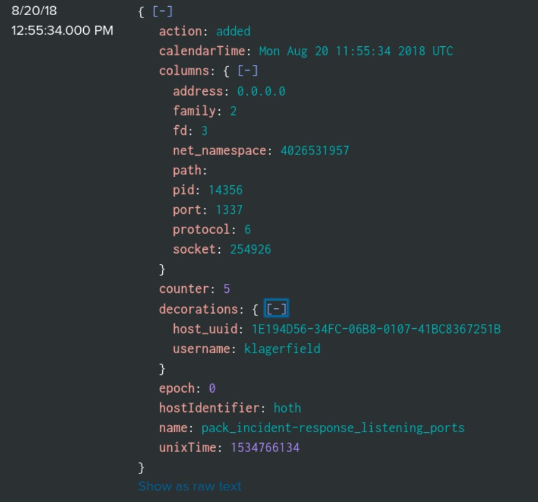
   
  <em>Figure 13: Osquery results identifying the process ID listening on port 1337.</em>

* **Analysis & Finding (Q7):** The Process ID (PID) is: **14356**. The process was identified as `netcat`, a classic tool for reverse shells often referred to as the "Swiss Army Knife" of hacking.

* **SOC & Strategic Reflection:** Port 1337 should never be open on a production web server. The presence of `netcat` implies that IT staff may have left dangerous tools on the server ("Living off the Land" binary).
    * **Operational Recommendation:** Firewall rules must be audited to ensure a "Default Deny" policy for ingress/egress traffic on non-standard ports.

#### Incident 8: Internal Reconnaissance (Scanning)
> **Context:** Once inside, attackers "map" the network to find servers with valuable data (e.g., SQL databases). This corresponds to MITRE ATT&CK T1046 (Network Service Scanning) [5].

* **Question:** What is the MD5 value of the file used to scan Frothly's network?
* **Investigative Methodology:** I returned to Sysmon Event ID 1 logs, looking for processes executing from suspicious directories (Temp) with network arguments. Sysmon automatically calculates the hash of every executed process.
    * **SPL Query:** `index=botsv3 sourcetype="xmlwineventlog:microsoft-windows-sysmon/operational" EventCode=1 Image="*\Temp\*"`

**Evidence:**

  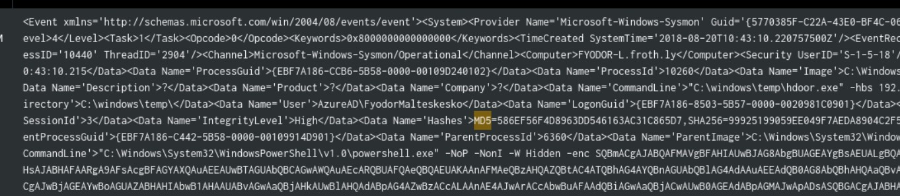
   
  <em>Figure 14: Sysmon logs identifying the C2 binary hdoor.exe and its network scanning arguments.</em>

* **Analysis & Finding (Q8):** The file `hdoor.exe` was used to scan the IP range 192.168.1.1-255. The MD5 hash is: **586EF5BF4D8963DD546163AC31C86507**

* **SOC & Strategic Reflection:** The execution of unsigned binaries from `C:\Windows\Temp` is a massive red flag. Temp folders are often world-writable, making them a favorite dropping point for malware.
    * **Operational Recommendation:** Application Whitelisting (e.g., AppLocker) would have blocked this file execution entirely, regardless of the antivirus signature database.

---

## 5.0 Strategic Analysis & Recommendations

### 5.1 SOC Maturity Assessment
To provide a clear path to improvement, we have analyzed the effectiveness of Frothly's current controls against the observed attack vectors. The chart below visualizes the current maturity gap.

  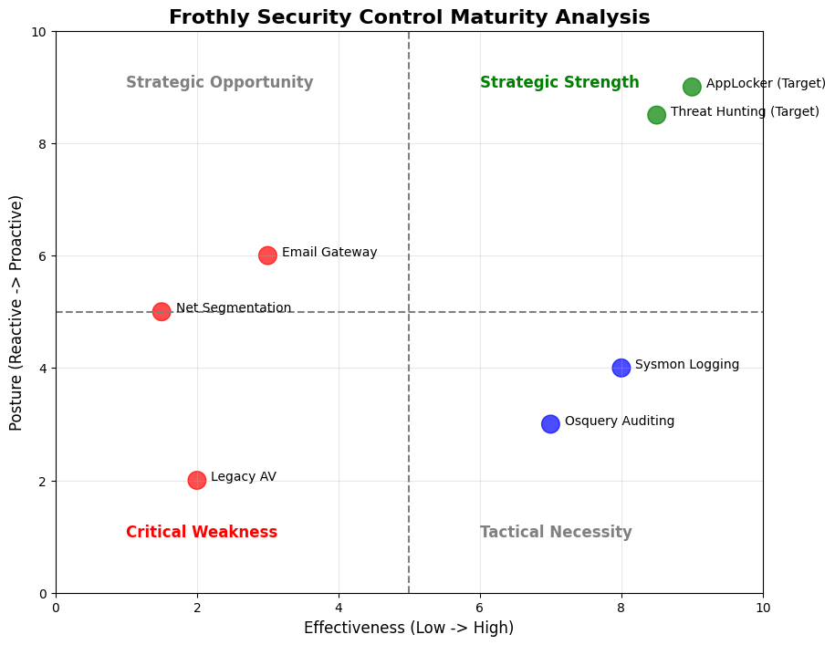
   
  <em>Figure 15: Security Control/Policy Analysis. Current controls are reactive, while proposed strategies move Frothly towards a proactive posture.</em>

### 5.2 Critical Comparison of Current vs. Target State
To demonstrate strategic improvement, the following table compares Frothly's current posture against the recommended target state.

|Security Control | Current State (Observed in BOTSv3) | Target State (Strategic Recommendation)|
| :--- | :--- | :--- |
| **Email Filtering** | Allowed `.xlsm` macros from external sources. | **Block all external macros.** Implement "SafeLinks" to detonate attachments in a sandbox before delivery. |
| **Endpoint Protection** | Reactive. Relied on antivirus signatures (Symantec). | **Proactive.** Enforce AppLocker (Allowlist) to block unsigned binaries like `hdoor.exe` in Temp folders. |
| **Identity Management** | Local Admin accounts (`svcvnc`) created without alerts. | **Just-In-Time (JIT) Admin Access.** Any local admin creation triggers a P1 SOC alert. |
| **Network Visibility** | Flat network. Workstations scanned servers (192.168.X.X). | **Micro-segmentation.** Workstations should be isolated from Server VLANs using Zero Trust ACLs [6]. |

### 5.3 Strategic Recommendations (People, Process, Technology)
To elevate Frothly's security posture from "Reactive" to "Adaptive", the following strategic initiatives are recommended:

#### I. Technology: Attack Surface Reduction (ASR)
The investigation confirmed that the initial compromise relied on Office macros spawning child processes.
* **Immediate Action:** Enable Microsoft Attack Surface Reduction (ASR) Rule: *Block all Office applications from creating child processes* [7]. This single configuration would have neutralized the `excel.exe` -> `HxTsr.exe` execution chain, effectively killing the attack at Phase 2.
* **Secondary Action:** Implement AppLocker policies to block execution of unapproved binaries in world-writable directories (`C:\Windows\Temp`).

#### II. Process: Risk-Based Alerting (RBA)
The SOC was flooded with individual alerts, delaying the detection of the "Low and Slow" scan.
* **Strategic Shift:** Move from "Atomic Alerting" to Risk-Based Alerting (RBA) within Splunk.
* **Implementation:** Instead of alerting on every "Process Creation," assign risk scores to specific behaviors (e.g., Netcat execution = *Risk: 40*, Port 1337 = *Risk: 30*, Temp Folder Execution = *Risk: 30*). An alert triggers only when the aggregate risk score for a host exceeds 80.

#### III. People: Threat Hunting & OpSec
The presence of a North Korean User Agent (`NaenaraBrowser`) went unnoticed until deep analysis.
* **Recommendation:** Formalize a Tier 3 Threat Hunting rotation. Analysts should dedicate 20% of their time to proactively searching for "outlier" data (e.g., User Agents with <1% prevalence) rather than simply closing tickets.

  
   
  <em>Figure 16: The Pyramid of Pain (Bianco, 2013)</em>

---

## 6.0 References
[1] P. Cichonski, T. Millar, T. Grance, and K. Scarfone, *Computer Security Incident Handling Guide*, NIST Special Publication 800-61 Rev. 2. Gaithersburg: U.S. Department of Commerce, 2012.

[2] ISO/IEC, *Information technology — Security techniques — Information security incident management — Part 1: Principles of incident management*, ISO/IEC 27035-1:2016, 2016.

[3] E. Hutchins, M. Cloppert, and R. Amin, "Intelligence-Driven Computer Network Defense Informed by Analysis of Adversary Campaigns and Intrusion Kill Chains," *Leading Issues in Information Warfare & Security Research*, vol. 1, no. 1, pp. 80-106, 2011.

[4] Splunk Inc., "Boss of the SOC (BOTS) Version 3 Dataset," GitHub Repository, 2020. [Online]. Available: https://github.com/splunk/botsv3. [Accessed: 27-Dec-2025].

[5] MITRE Corp., "MITRE ATT&CK Framework," *attack.mitre.org*, 2023. [Online]. Available: https://attack.mitre.org. [Accessed: 27-Dec-2025].

[6] S. Rose, O. Borchert, S. Mitchell, and S. Connelly, *Zero Trust Architecture*, NIST Special Publication 800-207. Gaithersburg, MD: National Institute of Standards and Technology, 2020.

[7] Microsoft, "Attack surface reduction rules reference," *Microsoft Learn*, 2023. [Online]. Available: https://learn.microsoft.com/en-us/microsoft-365/security/defender-endpoint/attack-surface-reduction-rules-reference. [Accessed: 27-Dec-2025].

[8] D. Bianco, "The Pyramid of Pain," *Enterprise Detection & Response*, 2013. [Online]. Available: http://detect-respond.blogspot.com/2013/03/the-pyramid-of-pain.html. [Accessed: 27-Dec-2025].
